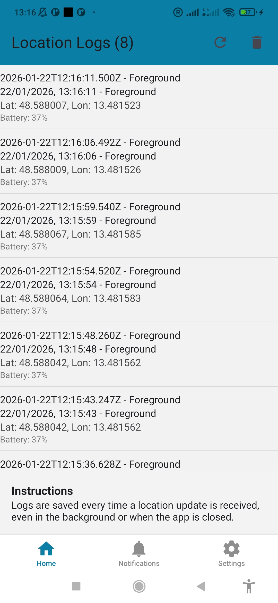
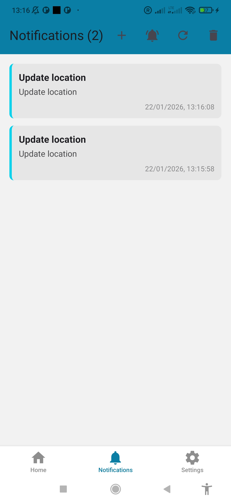
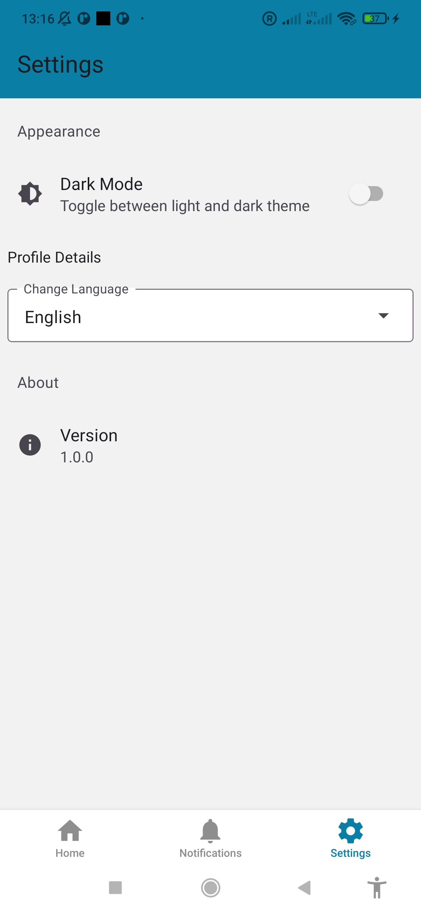
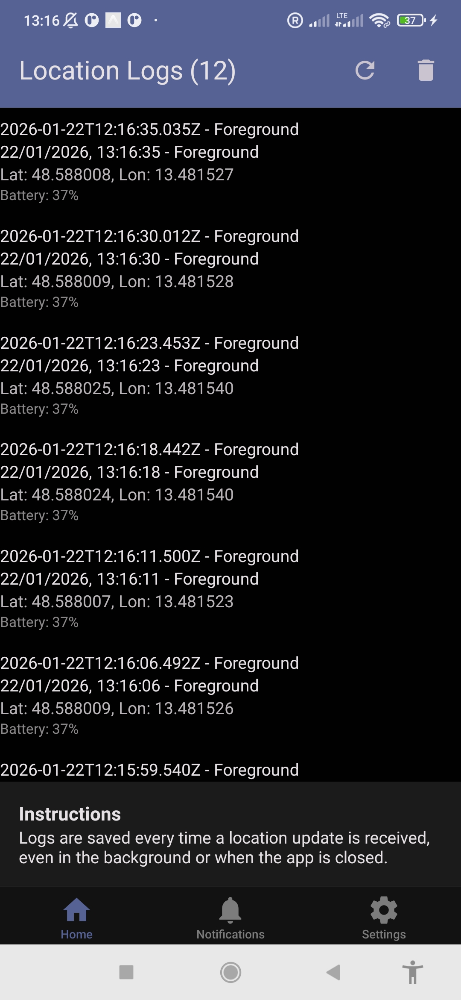
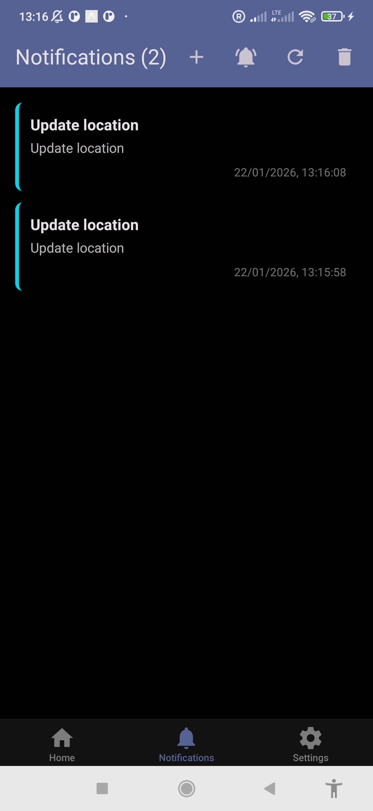
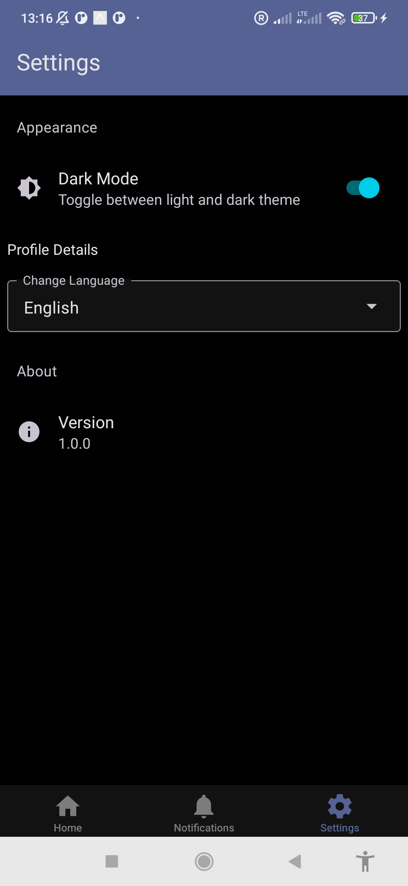
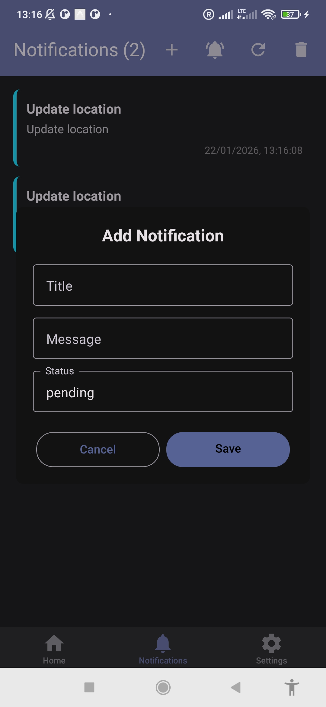

# SOS App 👋

An emergency response mobile application built with **Expo** and **React Native**, designed to help users quickly send and respond to SOS alerts with real-time location tracking.

## 📱 About the Project

The SOS App is a cross-platform mobile application that enables emergency responders to:

- Receive and respond to SOS alerts in real-time
- Track their location continuously in the background
- View and manage notifications
- Switch between different tracking modes
- Support multiple languages (English, Arabic, Deutsch)
- Seamlessly switch between dark and light themes

This application combines Expo's powerful development framework with React Native to deliver a fast, reliable emergency response solution across iOS, Android, and web platforms.

## 🚀 Quick Start

### Prerequisites

- Node.js (v16 or higher)
- npm or yarn
- Expo CLI: `npm install -g expo-cli`
- Android emulator or physical device for Android testing
- iOS Xcode for iOS development (Mac only)

### Installation & Running

1. **Clone the repository**

   ```bash
   git clone <repository-url>
   cd sos-app
   ```

2. **Install dependencies**

   ```bash
   npm install
   ```

3. **Start the development server**

   ```bash
   npm start
   ```

4. **Run on specific platform**
   - **Android**: `npm run android`
   - **iOS**: `npm run ios`
   - **Web**: `npm run web`

### Alternative: Using Expo Go

After running `npm start`, you can:

- Scan the QR code with Expo Go app (iOS/Android)
- View the app on your physical device instantly

## 📱 Features

- **Cross-Platform Support** - Runs on iOS, Android, and Web
- **Background Geolocation** - Continuous location tracking even when app is in background
- **Dark/Light Mode** - Automatic theme switching based on system preferences
- **Tab Navigation** - Intuitive bottom tab navigation with haptic feedback
- **Modal Support** - Native modal presentations for additional screens
- **File-Based Routing** - Modern routing using Expo Router
- **Multi-Language Support** - English, Arabic, and German localization
- **Real-Time Notifications** - Event-driven updates using EventEmitter3
- **Local Storage** - SQLite database with Drizzle ORM

## 📸 Screenshots

Here are some screenshots of the SOS App in action:

<div align="center">
  
  
  
  
</div>

<div align="center">
  
  
  
  
</div>

## 🛠️ Tech Stack

| Technology              | Version  | Purpose                           |
| ----------------------- | -------- | --------------------------------- |
| Expo                    | ~54.0.31 | Development framework             |
| React Native            | 0.81.5   | Cross-platform mobile development |
| React                   | 19.1.0   | UI library                        |
| Expo Router             | ~6.0.21  | File-based navigation             |
| React Navigation        | 7.x      | Navigation infrastructure         |
| React Native Paper      | 5.14.5   | Material Design UI components     |
| React Native Reanimated | ~4.1.1   | Animations                        |
| Background Geolocation  | ^5.0.0   | Location tracking                 |
| EventEmitter3           | Latest   | Event management                  |
| Drizzle ORM             | ^0.45.1  | Database ORM                      |
| Zustand                 | Latest   | State management                  |
| TypeScript              | ~5.9.2   | Type safety                       |

## 📂 Project Structure

```
sos-app/
├── app/                    # Application screens (file-based routing)
│   ├── (tabs)/            # Tab navigation screens
│   │   ├── _layout.tsx    # Tab navigator configuration
│   │   ├── index.tsx      # Home/Logs screen
│   │   ├── notifications.tsx # Notifications screen
│   │   └── settings.tsx   # Settings screen
│   ├── _layout.tsx        # Root layout with theme provider
│   └── modal.tsx          # Modal screen
├── assets/                 # Static assets (images, fonts)
├── src/
│   ├── components/        # Reusable UI components
│   ├── context/          # React Context (Theme, Localization)
│   ├── data/             # Data models and entities
│   ├── db/               # Database configuration and schema
│   ├── eventBus/         # Event emitter instance
│   ├── helpers/          # Utility functions
│   ├── hooks/            # Custom React hooks
│   ├── localization/     # Multi-language support
│   ├── services/         # Business logic and API services
│   ├── store/            # Zustand store definitions
│   └── styles/           # Theme and styling
├── drizzle/              # Database migrations
├── android/              # Android native code
├── package.json          # Dependencies and scripts
├── tsconfig.json         # TypeScript configuration
└── app.json              # Expo configuration
```

## 🔧 Available Scripts

- `npm start` - Start the Expo development server
- `npm run android` - Run app on Android emulator/device
- `npm run ios` - Run app on iOS simulator
- `npm run web` - Run app in web browser
- `npm run lint` - Run ESLint
- `npm run reset-project` - Reset project to initial state

## 📚 Documentation

For detailed technical documentation, see:

- `README_App_technical.md` - Technical architecture and implementation details
- `README_App_business.md` - Business features and requirements
- `GEOLOCATION_IMPLEMENTATION_GUIDE.md` - Location tracking setup guide

## 🐛 Troubleshooting

### Build issues on Android

- Clear cache: `npm run reset-project`
- Rebuild: `npm run android`

### Port conflicts

- Change port in `npm start -- --port 8081`

### Dependency issues

- Remove node_modules and reinstall: `rm -r node_modules && npm install`

## 📄 License

This project is proprietary. All rights reserved.

## 👤 Author

**Adham Khwaldeh**

- GitHub: [@adhamkhwaldeh](https://github.com/adhamkhwaldeh)
  | Typed Routes | Enabled |
  | React Compiler | Enabled |

### Platform-Specific Settings

**iOS:**

- Tablet support enabled

**Android:**

- Adaptive icon with custom foreground/background
- Edge-to-edge display enabled
- Background color: `#E6F4FE`

## 📦 Key Dependencies

### Production

- `expo` - Core Expo SDK
- `expo-router` - File-based routing
- `react-native-background-geolocation` - Background location tracking
- `react-native-reanimated` - Performance animations
- `react-native-gesture-handler` - Native gesture handling
- `expo-haptics` - Haptic feedback

### Development

- `typescript` - Static type checking
- `eslint` - Code linting

## 🔒 Permissions

The app requires the following permissions:

- **Location** (Background) - For SOS location tracking
- **Vibration** - For haptic feedback

## 🧪 Development Tips

1. **Hot Reload**: Changes to files auto-refresh in the app
2. **Developer Tools**: Press `cmd + d` (iOS) / `cmd + m` (Android) / `F12` (Web)
3. **Shake Device**: Opens the developer menu on physical devices

## � License

This project is private and not licensed for public distribution.

## 🤝 Contributing

This is a private project. Please contact the project maintainers for contribution guidelines.

---

Built with ❤️ using [Expo](https://expo.dev)
